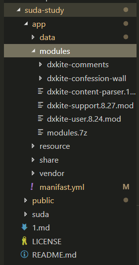
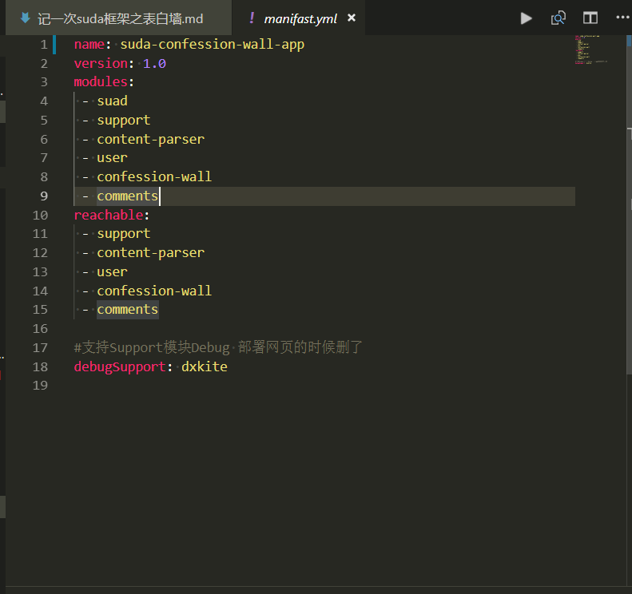
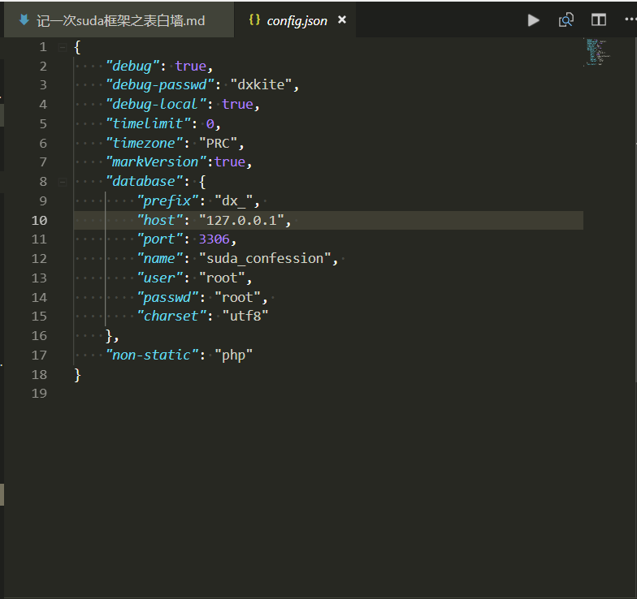
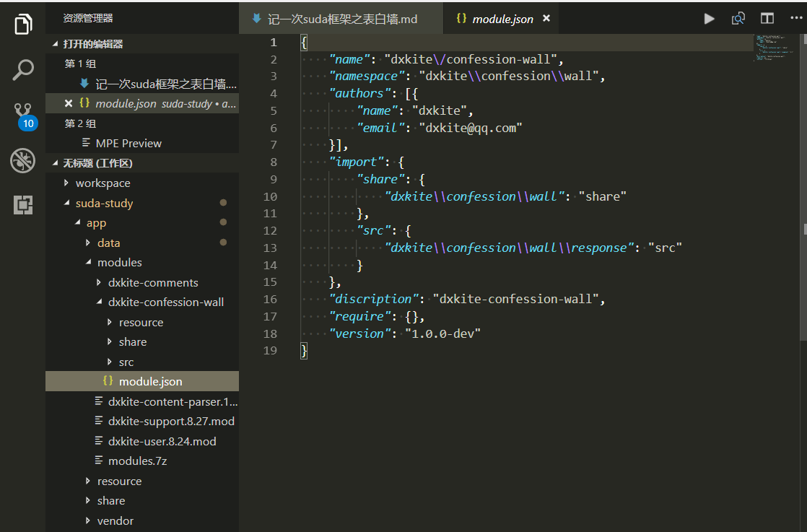
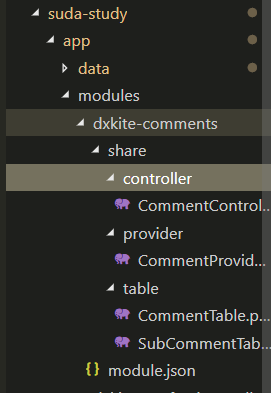
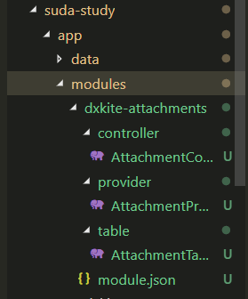

表白墙设计...大概需要这些功能吧

 - 发布表白
 - 列出表白
 - 表白管理
     + 增删改查
 - 评论功能
 - 附件功能

### 所需模块
 - support
 - user
 - content-parser

### 安装模块

1. 预览一下


2. `app/mainifast.yml` 原 `app/mainifast.json` 
>1. 为你的app改个好听的name
>2. 配置好启动的模块
>3. 使用`.yml`文件时需要将下载的`vendor` 添加至`app`中



3. `config.json` 可以考虑修改一下数据库



4. `modules` 把你的`share`和`import`弄好


5. `router.json`


### 基本配置&&发布表白

#### table

##### ConfessionTable.php

```php
<?php
namespace dxkite\confession\wall\table;

/**
 * 表对象，处理表白
 */
class ConfessionTable extends \suda\archive\Table
{
    const CONTENT_TYPE = 'markdown';

    const STATUS_DELETE = 0;  // 删除状态
    const STATUS_NORMAL = 1;  // 正常状态
    const STATUS_DRAFT = 2;  // 草稿状态
    const ANONYMOUS = 1;

    public function __construct()
    {
        parent::__construct('confession');
    }
    
    public function onBuildCreator($table)
    {
        return $table->fields(
            $table->field('id', 'bigint', 20)->primary()->unsigned()->auto(),
            $table->field('user', 'bigint', 20)->key()->comment('发布者'),
            $table->field('anonymous', 'tinyint', 1)->default(self::ANONYMOUS)->comment('匿名发布'),
            $table->field('title', 'varchar', 255)->comment('标题'),
            $table->field('content', 'text')->comment("文字内容"),
            $table->field('time', 'int', 11)->key()->unsigned()->comment('发表时间'),
            $table->field('ip', 'varchar', 32)->comment('发布IP'),
            $table->field('status', 'int', 11)->key()->unsigned()->default(self::STATUS_DRAFT)->comment('状态')
        );
    }
    
    /**
     * 使用Markdown 对内容进行默认编码
     *
     * @param string $content
     * @return void
     */
    protected function _inputContentField(string $content)
    {
        return content_pack($content, self::CONTENT_TYPE);
    }

    /**
     * 将内容解码成HTML格式
     *
     * @param string $content
     * @return void
     */
    protected function _outputContentField(string $content)
    {
        // 解码成对象
        if ($object = content_unpack($content)) {
            return $object;
        }
        // 未设置解码则按text编码
        return content_create($content, 'text');
    }
}
```

#### controller

##### ConfessionController.php
```php
<?php
namespace dxkite\confession\wall\controller;

use dxkite\confession\wall\table\ConfessionTable;

/**
 * 处理表白
 */
class ConfessionController
{
    protected $table;

    public function __construct()
    {
        $this->table = new ConfessionTable;
    }

    public function add(string $title, string $content, bool $anonymous=true): int
    {
        return $this->table->insert([
            'user' => get_user_id(),
            'title' => $title ,
            'content' => $content,
            'anonymous' => $anonymous ? 1 :0,
            'time' => time(),
            'ip' => request()->ip(),
            'status' => ConfessionTable::STATUS_NORMAL,
        ]);
    }
}
```

#### provider

##### ConfessionProvider.php

```php
<?php
namespace dxkite\confession\wall\provider;

use dxkite\confession\wall\controller\ConfessionController;

/**
 * 处理表白
 */
class ConfessionProvider
{
    protected $controller;

    public function __construct()
    {
        $this->controller = new ConfessionController;
    }

    public function add(string $title, string $content, bool $anonymous=true): int
    {
        return $this->controller->add($title,$content,$anonymous);
    }
}
```

#### src

##### IndexResponse.php

```php
<?php
namespace dxkite\confession\wall\response;

use dxkite\support\visitor\response\Response;
use dxkite\support\visitor\Context;


class IndexResponse extends Response
{
    public function onVisit(Context $context)
    {
        $view = $this->view('index');
        $view->render();
    }
}
```

##### PostResponse.php

```php
<?php
namespace dxkite\confession\wall\response;

use dxkite\support\visitor\response\VisitorResponse;
use dxkite\support\visitor\Context;
use dxkite\confession\wall\controller\ConfessionController;

class PostResponse extends VisitorResponse
{
    public function onUserVisit(Context $context)
    {
        $view = $this->view('post');
        if (request()->hasPost()) {
            $controller = new ConfessionController;
            $title = request()->post('title');
            $context =  request()->post('content');
            $anonymous = request()->post('anonymous',false) == true ?true:false;
            if ($title && $context) {
                $id = $controller->add($title,$context,$anonymous);
            }
        }
        $view->render();
    }
}
```

#### template

##### index.tpl.html

```html
@extend ('layout')
<!-- 插入内容 -->
@startInsert('confession-content')
<h3>这里是内容</h3>
@endInsert
```

##### header.tpl.html

```html
<nav class="navbar navbar-dark sticky-top bg-dark navbar-expand-lg flex-md-nowrap p-0">
    <a class="navbar-brand col-sm-3 col-md-2 mr-0" href="#">{{ $:website_name('涉外学院 - 表白墙') }}</a>
    <ul class="navbar-nav mr-auto">
    </ul>
    <ul class="navbar-nav px-3">
        <li class="nav-item text-nowrap">
            <a class="nav-link @b($this->isMe('index'),'active')" href="@u('index')">首页</a>
        </li>
    </ul>
</nav>
```

##### layout.tpl.html

```html
@extend ('support:bootstrap') 
@startInsert('bs-head')
<!-- css -->
@endInsert 
@startInsert('bs-content') 
@include ('header')
<div class="container">
    @if ($?:alert)
    <div class="alert alert-{{ $:alert.type }} m-2" role="alert"> {{ $:alert.text }}
        <button type="button" class="close" data-dismiss="alert" aria-label="Close">
            <span aria-hidden="true">&times;</span>
        </button>
    </div>
    @endif 
    @insert('confession-content')
</div>
@endInsert
```

##### post.tpl.html

```html
@extend ('layout') @startInsert('confession-content')
<form action="@u" method="post" class="my-2">
    <div class="form-group row">
        <label for="title" class="col-sm-2 col-form-label">{= 标题 }</label>
        <div class="col-sm-10">
            <input type="text" class="form-control" id="title" name="title">
        </div>
    </div>

    <div class="form-group row">
        <label for="description" class="col-sm-2 col-form-label">{= 具体内容 }</label>
        <div class="col-sm-10">
            <textarea class="form-control" name="content" id="description" rows="3"> </textarea>
        </div>
    </div>

    <div class="form-group row">
        <div class="col-2">
            <button type="submit" class="btn btn-info mb-2" name="action" value="publish">{= 发布 }</button>
        </div>
        <div class="checkbox col">
            <label>
                <input id="anonymous" name="anonymous" type="checkbox" value="true"> {= 匿名发表 }
            </label>
        </div>
    </div>
</form>
@endInsert
```
#### config

##### api

`mapper.yml`

```yml
v1.0:
  confession-wall: dxkite.confession.wall.provider.ConfessionProvider
```


**关于发布匿名表白及使用线路2进行匿名表白这里就略了，可直接会长的文章**
[https://dxkite.cn/2018/08/23/suda-confession-wall-simple-action/](https://dxkite.cn/2018/08/23/suda-confession-wall-simple-action/)


### 列出表白

#### table

##### ConfessionController.php

```php
<?php
namespace dxkite\confession\wall\controller;

use dxkite\confession\wall\table\ConfessionTable;
use dxkite\support\view\TablePager; // 引入分页函数类

/**
 * 处理表白
 */
class ConfessionController
{
    protected $table;

    public function __construct()
    {
        $this->table = new ConfessionTable;
    }

    /**
     * 添加表白帖
     *
     * @param string $title
     * @param string $content
     * @param boolean $anonymous
     * @return integer
     */
    public function add(string $title, string $content, bool $anonymous=true): int
    {
        return $this->table->insert([
            'user' => get_user_id(),
            'title' => $title ,
            'content' => $content,
            'anonymous' => $anonymous ? 1 :0,
            'time' => time(),
            'ip' => request()->ip(),
            'status' => ConfessionTable::STATUS_NORMAL,
        ]);
    }


    public function list(?int $page, int $row = 10):?array
    {
        //  列出表元素，当状态为：ConfessionTable::STATUS_NORMAL 的时候
        return TablePager::listWhere($this->table, ['status' => ConfessionTable::STATUS_NORMAL], [], $page, $row);
    }
}
```
#### provider

##### ConfessionProvider.php

**添加列出函数**

1.方案一
```php
public function list(?int $page, int $row = 10):?array
{
    $pageData = $this->controller->list($page, $row);
    $pageRows = $pageData['rows']; // 获取到数据字段
    foreach ($pageRows as $index => $pageRow ) {
        // 表示匿名状态
        if ($pageRow['anonymous'] == 1) {
            // 清理user的信息
            $pageRow['user'] = 0;
        }else{
            // 根据ID获取信息
            $pageRow['user'] = get_user_public_info($pageRow['user']);
        }
        // 去除IP信息
        unset($pageRow['ip']);
        // 替换原来的列
        $pageRows[$index] = $pageRow;
    }
    // 放回原来的字段
    $pageData['rows'] = $pageRows;
    return $pageData;
}
```


2.方案二
```php
public function list(?int $page, int $row = 10):?array
{
    $pageData = $this->controller->list($page, $row);
    $pageRows = $pageData['rows']; // 获取到数据字段
    // 检测到需要处理的用户ID
    $userIdMap = [];
    foreach ($pageRows as $index => $pageRow) {
        // 表示匿名状态
        if ($pageRow['anonymous'] == 1) {
            // 清理user的信息
            $pageRow['user'] = 0;
        } else {
            // 记录ID信息
            // ID => 索引
            $userIdMap[$pageRow['user']]=$index;
        }
        // 去除IP信息
        unset($pageRow['ip']);
        // 替换原来的列
        $pageRows[$index] = $pageRow;
    }
    // 获取所有用户信息
    $userInfos = get_user_public_info_array(array_keys($userIdMap));
    // 返回到数据列
    foreach ($userInfos as $id => $data) {
        // $userIdMap[$id] == index
        $pageRows[$userIdMap[$id]]['user']=$data;
    }
    // 放回原来的字段
    $pageData['rows'] = $pageRows;
    return $pageData;
}
```

### 表白管理

#### config

`permissions.yml`

```yml
confession-wall:
  name: 表白墙权限管理
  childs:
    view: 查看表白列表
    status: 编辑列表状态
    edit: 编辑表白
    delete: 删除表白
```


##### api

`mapper.yml`

```yml
v1.0:
  confession-wall: dxkite.confession.wall.provider.ConfessionProvider
  confession-wall-setting: dxkite.confession.wall.provider.ConfessionSettingProvider
```
#### provider

##### ConfessionSettingProvider.php

```php
<?php
namespace dxkite\confession\wall\provider;

use dxkite\confession\wall\controller\ConfessionController;

/**
 * 管理表白
 */
class ConfessionSettingProvider
{
    protected $controller;

    public function __construct()
    {
        $this->controller = new ConfessionController;
    }

    /**
     * 列出表白墙列表
     *
     * @acl confession-wall.view
     * @param integer|null $page
     * @param integer $row
     * @return array|null
     */
    public function list(?int $page, int $row = 10):?array
    {
        $pageData = $this->controller->list($page, $row);
        $pageRows = $pageData['rows']; // 获取到数据字段
        // 检测到需要处理的用户ID
        $userIdMap = [];
        foreach ($pageRows as $index => $pageRow) {
            $userIdMap[$pageRow['user']][]=$index;
        }
        // 获取所有用户信息
        $userInfos = get_user_public_info_array(array_keys($userIdMap));
        // 返回到数据列
        foreach ($userInfos as $id => $data) {
            foreach ($userIdMap[$id] as $index) {
                $pageRows[$index]['user']=$data;
            }
        }
        // 放回原来的字段
        $pageData['rows'] = $pageRows;
        return $pageData;
    }
}
```

可能你会缺少这个`use dxkite\confession\wall\table\ConfessionTable;`


**有关添加权限角色与列出等操作，请移步会长文章**

[https://dxkite.cn/2018/08/25/suda-confession-wall-setting/](https://dxkite.cn/2018/08/25/suda-confession-wall-setting/)

### 编辑删除

#### provider

##### ConfessionSettingProvider.php

**添加编辑函数**

```php
/**
 * 编辑内容
 *
 * @acl confession-wall.edit
 * @param integer $id
 * @param array $value
 * @return boolean
 */
public function edit(int $id, array $value):bool
{
    $table = new ConfessionTable;
    if (array_key_exists('title', $value)) {
        $sets['title']=$value['title'];
    }
    if (array_key_exists('content', $value)) {
        $sets['content']=$value['content'];
    }
    return $table->updateByPrimaryKey($id,$sets) > 0;
}
```

**添加编辑函数**

```php
/**
 * 删除内容
 * @acl confession-wall.delete
 * @param integer $id
 * @return boolean
 */
public function delete(int $id):bool {
    $table = new ConfessionTable;
    return $table->updateByPrimaryKey($id,['status' => ConfessionTable::STATUS_DELETE ]) > 0;
}
```

**操作部分省略，移步文章**
[https://dxkite.cn/2018/08/26/suda-confession-wall-setting-edit-delete/](https://dxkite.cn/2018/08/26/suda-confession-wall-setting-edit-delete/)

### 评论功能
1. 预览一下


2. `module.json` 注意写一下

3. `app/mainifast.yml`
>1. 启动相应模块 support && 评论

#### table

##### CommentTable.php

```php
<?php
namespace dxkite\comments\table;

/**
 * 评论
 */
class CommentTable extends \suda\archive\Table
{
    const CONTENT_TYPE = 'markdown';

    const STATUS_DELETE = 0;  // 删除状态
    const STATUS_NORMAL = 1;  // 正常状态
    const STATUS_DRAFT = 2;  // 草稿状态

    public function __construct(string $subfix=null)
    {
        parent::__construct('comment'. self::parseSubfix($subfix));
    }
    
    protected function parseSubfix(?string $subfix) {
        if (!is_null($subfix)) {
            $subfix = '_'.$subfix;
            return preg_replace('/[^\w]+/','_',$subfix);
        }
        return '';
    }

    public function onBuildCreator($table)
    {
        return $table->fields(
            $table->field('id', 'bigint', 20)->primary()->unsigned()->auto(),
            $table->field('user', 'bigint', 20)->key()->comment('发布者'),
            $table->field('target', 'bigint', 20)->key()->comment('目标'),
            $table->field('content', 'text')->comment("文字内容"),
            $table->field('time', 'int', 11)->key()->unsigned()->comment('发表时间'),
            $table->field('ip', 'varchar', 32)->comment('发布IP'),
            $table->field('status', 'int', 11)->key()->unsigned()->default(self::STATUS_DRAFT)->comment('状态')
        );
    }
    
    /**
     * 使用Markdown 对内容进行默认编码
     *
     * @param string $content
     * @return void
     */
    protected function _inputContentField(string $content)
    {
        return content_pack($content, self::CONTENT_TYPE);
    }

    /**
     * 将内容解码成HTML格式
     *
     * @param string $content
     * @return void
     */
    protected function _outputContentField(string $content)
    {
        // 解码成对象
        if ($object = content_unpack($content)) {
            return $object;
        }
        // 未设置解码则按text编码
        return content_create($content, 'text');
    }
}
```

##### SubCommentTable.php

```php
<?php
namespace dxkite\comments\table;

/**
 * 子评论
 */
class SubCommentTable extends CommentTable
{
    public function __construct(string $subfix =null)
    {
        parent::__construct('sub' .self::parseSubfix($subfix));
    }

    public function onBuildCreator($table)
    {
        $table = parent::onBuildCreator($table);
        return $table->fields(
            $table->field('parent', 'bigint', 20)->key()->comment('父评论'),
            $table->field('reply', 'bigint', 20)->key()->comment('回复')
        );
    }
}
```

#### controller

##### CommentController.php

```php
<?php
namespace dxkite\comments\controller;

use dxkite\comments\table\CommentTable;
use dxkite\comments\table\SubCommentTable;
use dxkite\support\view\TablePager;

/**
 * 评论
 */
class CommentController
{
    protected $commentTable;
    protected $subCommentTable;

    public function __construct(string $name = null)
    {
        $this->commentTable= new CommentTable($name);
        $this->subCommentTable= new SubCommentTable($name);
    }

    /**
     * 评论
     *
     * @param integer $target
     * @param string $content
     * @return integer
     */
    public function add(int $target, string $content):int
    {
        $user =  get_user_id();
        return $this->commentTable->insert([
            'user' => $user,
            'target' => $target,
            'content' => $content,
            'time' => time(),
            'ip' => request()->ip(),
            'status' =>  CommentTable::STATUS_NORMAL,
        ]);
    }

    /**
     * 评论评论
     *
     * @param integer $comment
     * @param string $content
     * @return integer
     */
    public function comment(int $comment, string $content):int
    {
        $user =  get_user_id();
        if ($parent = $this->commentTable->getByPrimaryKey($comment)) {
            return $this->subCommentTable->insert([
                'user' => $user,
                'target' => $parent['target'],
                'content' => $content,
                'parent'=> $comment,
                'time' => time(),
                'ip' => request()->ip(),
                'status' =>  CommentTable::STATUS_NORMAL,
            ]);
        }
        return 0;
    }

    /**
     * 删除评论
     *
     * @param integer $comment
     * @param boolean $sub
     * @return boolean
     */
    public function delete(int $comment, bool $sub = false):bool
    {
        $user =  get_user_id();
        $table = $sub ? $this->subCommentTable : $this->commentTable;
        if ($that = $table->getByPrimaryKey($comment)) {
            // 只有自己能够删除
            if ($that['user'] == $user) {
                return $table->updateByPrimaryKey($that['id'], [
                    'status' =>  CommentTable::STATUS_DELETE,
                ]) > 0;
            }
        }
    }

    /**
     * 回复子评论
     *
     * @param integer $subcommet
     * @param string $content
     * @return integer
     */
    public function reply(int $subcommet, string $content):int
    {
        $user =  get_user_id();
        if ($parent = $this->subCommentTable->getByPrimaryKey($subcommet)) {
            return $this->subCommentTable->insert([
                'user' => $user,
                'target' => $parent['target'],
                'reply' => $parent['user'],
                'content' => $content,
                'parent'=> $parent['parent'],
                'time' => time(),
                'ip' => request()->ip(),
                'status' =>  CommentTable::STATUS_NORMAL,
            ]);
        }
        return 0;
    }

    /**
     * 获取目标评论
     *
     * @param integer $target
     * @param integer|null $page
     * @param integer $row
     * @return array|null
     */
    public function getComment(int $target, ?int $page, int $row = 10):?array
    {
        return TablePager::listWhere($this->commentTable, ['status' => CommentTable::STATUS_NORMAL], [], $page, $row);
    }

    /**
     * 获取评论的评论
     *
     * @param integer $comment
     * @param integer|null $page
     * @param integer $row
     * @return array|null
     */
    public function getSubComment(int $comment, ?int $page, int $row = 10):?array
    {
        return TablePager::listWhere($this->subCommentTable, ['status' => CommentTable::STATUS_NORMAL], [], $page, $row);
    }
}
```

#### provider

##### CommentProvider.php

```php
<?php
namespace dxkite\comments\provider;

use dxkite\comments\controller\CommentController;

/**
 * 评论
 */
class CommentProvider
{
    protected $name = '';
    protected $commentTable;
    protected $subCommentTable;

    public function __construct(string $name = null)
    {
        $this->controller =  new CommentController($name);
    }

    /**
     * 评论
     *
     * @param integer $target
     * @param string $content
     * @return integer
     */
    public function add(int $target, string $content):int
    {
        return $this->controller->add($target, $content);
    }

    /**
     * 评论评论
     *
     * @param integer $comment
     * @param string $content
     * @return integer
     */
    public function comment(int $comment, string $content):int
    {
        return $this->controller->comment($comment, $content);
    }

    /**
     * 回复子评论
     *
     * @param integer $subcommet
     * @param string $content
     * @return integer
     */
    public function reply(int $subcommet, string $content):int
    {
        return $this->controller->reply($subcommet, $content);
    }

    /**
     * 获取目标评论
     *
     * @param integer $target
     * @param integer|null $page
     * @param integer $row
     * @return array|null
     */
    public function getComment(int $target, ?int $page=null, int $row=10):?array
    {
        $comments = $this->controller->getComment($target, $page, $row);
        $rows = $comments['rows'];
        $ids = [];
        foreach ($rows as $index => $row) {
            $ids[] = $row['user'];
            unset($row['ip']);
            $rows[$index] = $row;
        }
        $userInfos = get_user_public_info_array($ids);
        foreach ($rows as $index => $row) {
           $rows[$index]['user'] = $userInfos[$row['user']] ?? $row['user'];
        }
        $comments['rows'] = $rows;
        return $comments;
    }

    /**
     * 获取评论的评论
     *
     * @param integer $comment
     * @param integer|null $page
     * @param integer $row
     * @return array|null
     */
    public function getSubComment(int $comment, ?int $page=null, int $row=10):?array
    {
        $comments = $this->controller->getSubComment($comment, $page, $row);
        $rows = $comments['rows'];
        $ids = [];
        foreach ($rows as $index => $row) {
            $ids[] = $row['user'];
            unset($row['ip']);
            $rows[$index] = $row;
        }
        $userInfos = get_user_public_info_array($ids);
        foreach ($rows as $index => $row) {
            $rows[$index]['user'] = $userInfos[$row['user']] ?? $row['user'];
            $rows[$index]['reply'] = $userInfos[$row['reply']] ?? $row['reply'];
         }
        $comments['rows'] = $rows;
        return $comments;
    }

    /**
     * 删除特定评论
     *
     * @param integer $comment
     * @param boolean $sub
     * @return boolean
     */
    public function delete(int $comment, bool $sub = false):bool
    {
        return $this->controller->delete($comment, $sub);
    }
}
```

#### config (confession.wall)

##### api

```yml
v1.0:
  confession-wall: dxkite.confession.wall.provider.ConfessionProvider
  confession-wall-comment: dxkite.comments.provider.CommentProvider(confession-wall)
  confession-wall-setting: dxkite.confession.wall.provider.ConfessionSettingProvider
```

**不逼逼了，直接给链接**

[https://dxkite.cn/2018/08/27/suda-comment/](https://dxkite.cn/2018/08/27/suda-comment/)

### 附件功能
1. 预览一下


2. `module.json` 注意写一下

3. `app/mainifast.yml`
>1. 启动相应模块

#### table

##### CommentTable.php

```php
<?php
namespace dxkite\attachments\table;

use suda\tool\Command;
use suda\archive\Table;

/**
 * 附件表
 */
class AttachmentTable extends Table
{
    protected $target;

    public function __construct(string $target=null)
    {
        // 实例化一个字符串到类
        $this->target = Command::newClassInstance($target);
        $perfix = self::parsePerfix($this->target->getTableName());
        parent::__construct($perfix.'attachments');
    }

    public function getTargetTable():Table
    {
        return $this->target;
    }

    protected function parsePerfix(?string $fix)
    {
        if (!is_null($fix)) {
            $fix = $fix.'_';
            return ltrim(preg_replace('/[^\w]+/', '_', $fix), '_');
        }
        return '';
    }

    public function onBuildCreator($table)
    {
        return $table->fields(
            $table->field('id', 'bigint', 20)->primary()->unsigned()->auto(),
            $table->field('target', 'bigint', 20)->unsigned()->comment('目标内容'),
            $table->field('attachment', 'bigint', 20)->unsigned()->comment('附件ID'),
            $table->field('hash', 'varchar', 32)->comment('附件Hash'),
            $table->field('time', 'int', 11)->key()->unsigned()->comment('添加时间')
        );
    }
}
```

#### controller

##### AttachmentController.php

```php
<?php
namespace dxkite\attachments\controller;

use suda\core\Query;
use suda\exception\SQLException;
use dxkite\support\file\File;
use dxkite\support\file\Media;
use dxkite\attachments\table\AttachmentTable;

/**
 * 附件控制器
 */
class AttachmentController
{
    protected $table;
    protected $target;
    protected $userField;

    public function __construct(string $target, string $userField = 'user')
    {
        
        $this->table=new AttachmentTable($target);
        $this->target = $this->table->getTargetTable();
        $this->userField = $userField;
    }

    public function add(int $target, File $attachment):bool
    {
        if ($targetData = $this->target->getByPrimaryKey($target)) {
            if ($targetData[$this->userField] == get_user_id()) {
                if ($this->table->select('*', ['hash'=>$attachment->getMd5(),'target'=>$target])->fetch()) {
                    return true;
                } else {
                    $file = Media::save($attachment);
                    if (!$file) {
                        return false;
                    }
                    return $this->table->insert([
                        'time'=>time(),
                        'target'=> $target,
                        'attachment' => $file->getId(),
                        'hash' => $attachment->getMd5(),
                    ]) > 0;
                }
            } else {
                return false;
            }
        }
    }

    public function getAttachments(int $target):?array
    {
        if ($images = $this->table->select('*', ['target'=>$target])->fetchAll()) {
            return $images;
        }
        return null;
    }

    public function delete(int $attachmentId):bool
    {
        if ($fetchData = $this->table->select(['attachment','target'], ['id'=>$attachmentId])->fetch()) {
            list('target'=>$target,'attachment' => $attachment) = $fetchData;
            if ($targetData = $this->target->getByPrimaryKey($target)) {
                if ($targetData[$this->userField] == get_user_id()) {
                    Media::delete($attachment);
                    return $this->table->delete(['id'=>$attachmentId]) > 0;
                } else {
                    return false;
                }
            }
        }
        return false;
    }
}
```

#### provider

##### AttachmentProvider.php

```php
<?php
namespace dxkite\attachments\provider;

use dxkite\attachments\controller\AttachmentController;
use dxkite\support\file\File;

/**
 * 附件
 */
class AttachmentProvider
{
    protected $controller;

    public function __construct(string $name = null)
    {
        $this->controller =  new AttachmentController($name);
    }
    
    public function add(int $target, File $attachment):bool
    {
        return $this->controller->add($target, $attachment);
    }

    public function getAttachments(int $target):?array
    {
        return $this->controller->getAttachments($target);
    }

    public function delete(int $attachmentId):bool
    {
        return $this->controller->delete($attachmentId);
    }
}
```

#### config (confession.wall)

##### api

```yml
v1.0:
  confession-wall: dxkite.confession.wall.provider.ConfessionProvider
  confession-wall-comment: dxkite.comments.provider.CommentProvider(confession-wall)
  confession-wall-attachment: dxkite.attachments.provider.AttachmentProvider(dxkite.confession.wall.table.ConfessionTable)
  confession-wall-setting: dxkite.confession.wall.provider.ConfessionSettingProvider
```

**具体操作就...**

[https://dxkite.cn/2018/08/28/suda-attachments/](https://dxkite.cn/2018/08/28/suda-attachments/)

大概就是这样 基本的功能已经实现